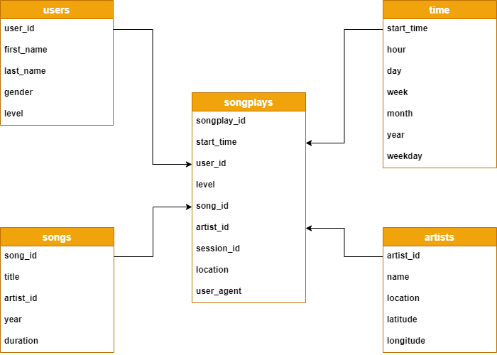

# Data Modeling and ETL Pipeline using Postgres and Python

## Introduction

A startup called Sparkify wants to analyze the data they've been collecting on songs and user activity on their new music streaming app. The analytics team is particularly interested in understanding what songs users are listening to. Currently, they don't have an easy way to query their data, which resides in a directory of JSON logs on user activity on the app, as well as a directory with JSON metadata on the songs in their app.

## Purpose

It is difficult to view and query data in JSON format. The goal is to create a postgres database with ETL Pipeline to help Sparkify do their analysis easily.

## Datasets

### 1. Song Dataset
This dataset is a subset of real data from the Million Song Dataset. Each file is in JSON format and contains metadata about a song and the artist of that song. The files are partitioned by the first three letters of each song's track ID. 

### 2. Log Dataset
This dataset consists of log files in JSON format generated by this event simulator based on the songs in the dataset above. These simulate activity logs from a music streaming app based on specified configurations.The log files in the dataset you'll be working with are partitioned by year and month. 

## Database Schema Design
For this database, I have used Star schema shown in a diagram below:
* It has 4 dimension viz., users, songs, artists, and time
* 1 Fact table : songplays

## ETL Pipeline

1. <b>etl.py</b> contains the ETL pipeline for the project.
2. There are two functions for processing data. One is for processing song data and other is for processing log data.
3. We iterate through all the files and send them to a respective function to process and insert the data into a table.
4. If the similar records are present in file, on conflict we do nothing and skip processing that record.

## How to run

1. Run create_tables.py to create a database and tables. You can run it by using <b> python create_tables.py</b>
2. Test if tables are created using <b>test.ipynb</b> file. Restart the kernel to close the connnection after running this notebook.
3. Run <b>etl.ipynb</b> to test the pipeline for single file.
4. Run <b>etl.py</b> which iterates through all the JSON files in both datasets and insert the data into respective tables.
5. Again run <b>test.ipynb</b> to make sure if the data is inserted successfully.
